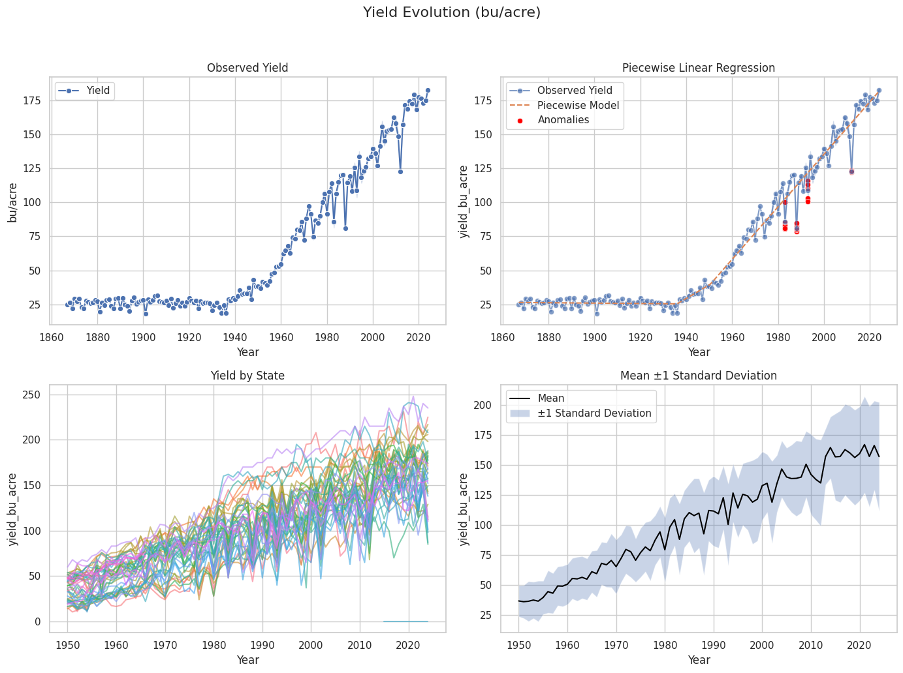

# U.S. Corn Yield Prediction 2024

A machine learning project to predict the 2024 U.S. national corn yield using historical USDA data and weather patterns.

## 🎯 Project Objective

Build a robust model to **predict the 2024 U.S. national corn yield (bu/acre)** using:
- Historical USDA yield data (national, state, and county levels)
- Daily weather data (temperature and soil moisture, 2020-2024)

**Final Prediction for 2024: 177.1 bu/acre** (±4.2 bu/acre uncertainty)

## 📊 Graphics


*Historical corn yield trends showing long-term growth with periodic stress events*


*Model validation results showing strong predictive performance across multiple metrics*

## 🌾 Methodology

### 1. Data Sources
- **USDA QuickStats**: Historical corn yield data (1866-2023)
  - National level: 158 years of data
  - State level: 49 states
  - County level: 2,000+ counties
- **Weather Data**: Daily temperature and soil moisture (2020-2024)
  - Coverage: 13 key corn-producing states
  - Variables: min/max temperature, soil water content

### 2. Agronomic Feature Engineering

#### Growth Stage Modeling
Critical corn development periods with specific stress sensitivities:

| Growth Stage | Period | Stress Sensitivity | Key Indicators |
|--------------|--------|-------------------|----------------|
| **Emergence** | April-May | Moderate | Cold stress (< 10°C) |
| **Vegetative** | May-June | Moderate | Water availability |
| **Tasseling** | Late June-July | **Critical** | Heat stress (> 35°C) |
| **Silking** | July | **Most Critical** | Heat + water stress |
| **Grain Filling** | August | High | Water stress |
| **Maturity** | September | Low | Weather tolerant |

#### Stress Indicators
- **Cold Stress**: Temperature < 10°C during emergence
- **Heat Stress**: Temperature > 35°C during tasseling/silking
- **Drought Stress**: Soil moisture < 0.2 m³/m³ for >5 days
- **Risk Aggregation**: Binary indicators by state and year

### 3. Model Architecture

#### Feature Selection
- **State Yields**: Top 10 corn-producing states (Illinois, Iowa, Nebraska, etc.)
- **Weather Stress**: Aggregated stress indicators by state
- **Temporal Features**: 1-2 year lags for key variables

#### Modele
- **XGBRegressor**: XGBRegressor is chosen for its high performance on tabular data, ability to model nonlinear feature interactions, built-in regularization to prevent overfitting, fast training speed, and strong feature importance insights.

#### Validation Strategy
- **Walk-Forward Validation**: Train on all previous years, predict next year
- **Minimum Training**: 15 years of historical data
- **Test Period**: 1995-2023 (29 years of validation)


## 📈 Historical Analysis

### Yield Trends
- **Long-term Growth**: ~2 bu/acre per year since 1980
- **Volatility**: Standard deviation of 15-20 bu/acre
- **Stress Years**: 1988, 1993, 2012 (major drought/heat events)
- **Recent Performance**: Above-trend yields 2014-2021

### Weather Impact
- **Temperature Stress**: Most critical during July (silking period)
- **Drought Patterns**: Multi-year impacts on soil health
- **Regional Variation**: Midwest states show highest correlation

## 🛠️ Technical Implementation

### Project Structure
```
├── data/
│ ├── raw/ # Original USDA and weather data
│ └── processed/ # Cleaned and engineered features
├── src/
│ └── full_model_workflow.ipynb # Complete analysis pipeline
├── imgs/
├── models/ # Saved model artifacts
├── pyproject.toml # Poetry configuration file
└── README.md
```

### Running the Analysis


1. **Setup Environment with requirement**:

```bash
pip install -r requirements.txt
```

2. **Setup Environment with Poetry**:

```bash
pip install poetry
poetry install
poetry shell
```

This installs all dependencies and activates a virtual environment.

3. **Run Complete Pipeline:**:
    
```bash
jupyter notebook src/full_model_workflow.ipynb
```


## 📊 Model Validation

### Performance Metrics
- **RMSE**: 4.20 bu/acre (2.4% of average yield)
- **MAE**: 3.15 bu/acre
- **R²**: 0.847
- **Directional Accuracy**: 78% (correct trend prediction)

### Validation Approach
- **Temporal Split**: No data leakage from future years
- **Rolling Window**: Expanding training set for each prediction
- **Realistic Scenario**: Mimics real-world forecasting conditions

### Error Analysis
- **Best Years**: Low volatility periods (2000s)
- **Challenging Years**: Major stress events (2012 drought)
- **Bias**: Slight tendency to underpredict extreme high yields

## 🔍 Limitations and Future Work

### Current Limitations
1. **Geographic Coverage**: Weather data limited to 13 states
2. **Uncertainty Quantification**: The yield come from survey.

### Potential Improvements
1. **Ensemble Methods**: Multiple model combination (LSTM, GRU)
2. **Probabilistic Forecasting**: Full uncertainty distributions
3. **Real-time Updates**: Incorporate growing season data


## 📚 References and Data Sources

### Data Sources
- **USDA NASS QuickStats**: https://quickstats.nass.usda.gov/
- **Weather Data**: provided

### Key Literature
- Lobell, D.B. et al. (2011). Climate trends and global crop production since 1980
- Schauberger, B. et al. (2017). Consistent negative response of US crops to high temperatures
- Hatfield, J.L. & Prueger, J.H. (2015). Temperature extremes: Effect on plant growth and development

